Описание проекта:
    Информационный бот. Производит поиск по сайту https://www.hotels.com и выдаёт информацию пользователю.
    Поиск происходит с набором критериев, которые определяет пользователь.

Инструкция по запуску:
    Должен быть установлен Telegram.
    Выполненены условия, описанные в файле .env.template.
    Запустить исполняемый файл main.py
    
Описание архитектуры:
    Папка config_data содержит файл config.py.
        config.py подгружает токен бота и ключ для пользования API из файла .env, так же содержит список базовых комманд, в которые можно легко внести изменения.
    Папка database содержит 3 файла: history.db (появляется после первого использования бота), hotels_data.py, users_data.py
        hotels_data.py и users_data.py хранят временную информацию о отеле и пользователе соответственно.
        history.db является простой базой данных, которая сохраняет введённую команду, время её ввода и найденные отели, если пользователь дошёл до конца сценария.
    Папка handlers содержит папки custom и default_handlers
        default_handlers содержит в себе базовые команды для бота: /start - приветствие, /help - выводит список команд, и эхо-команда для всех неопределнных сообщений.
        custom содержит в себе основные функции бота:
            Все команды для поиска отелей начинаются с base, далее идут по пользовательскому сценарию и попадают в lowprice, highprice, bestdeal или history.
    Папка keyboards содержит в себе 2 вида клавиатур: inline и reply
        В этом проекте используется только Reply:
            По сути обычная клавиатура, только в виде кнопок для удобства.
        inline клавитура более сложный и гибкий инструмент, но здесь она не используется.
    В папке states прописаны состояния пользователя через класс.
        Используется для простоты и удобства при прохождении опроса.
    В папке utils содержатся все функции для обработки запросов и вывода результатов, а так же некоторые переменные и магические числа.
    Файл .env нужно создать исходя из инструкции в файле .env.template.
    В файл .gitignore занесены папки и файлы, изменения в которых не должны отслеживаться гитом или средой разработки. 
    Файл loader.py инициализирует бота.
    Файл main.py является исполняемым, то есть запускать нужно именно его, если хотите запустить бота. 
    В файл requirements.txt занесены библиотеки, которые нужно скачать перед использованием бота.

Скриншоты с работой бота:
    Команда /lowprice без фотографий: 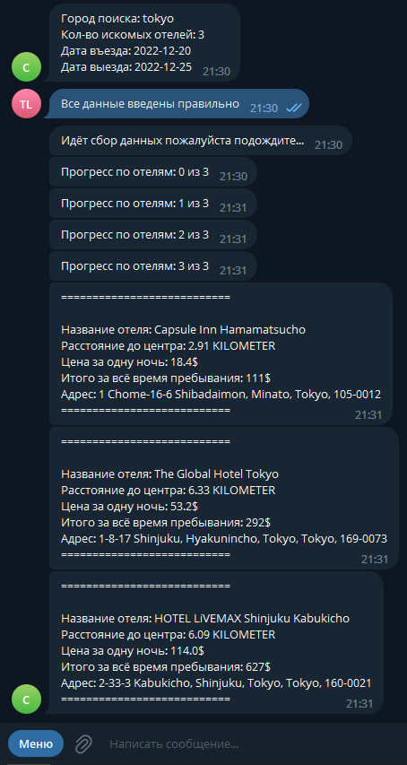
    Команда /lowprice с фотографиями: 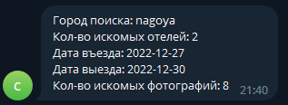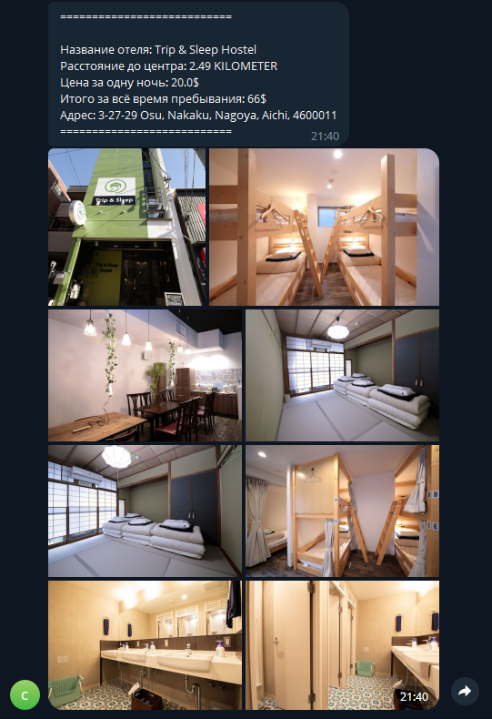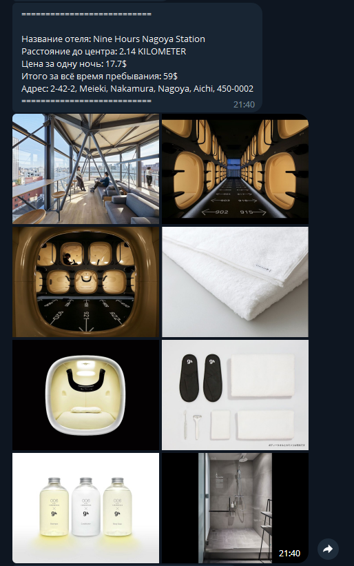
    Команда /highprice без фотографий: 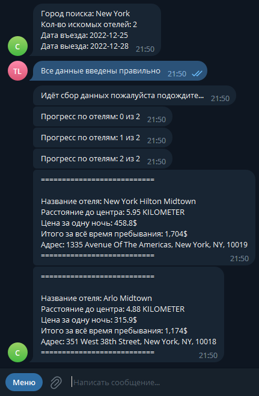
    Команда /highprice с фотографиями: 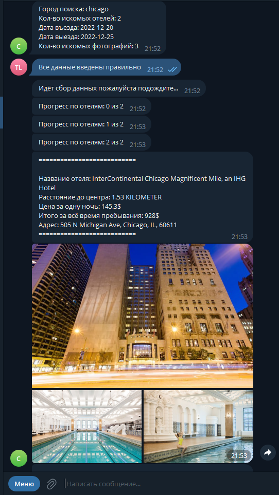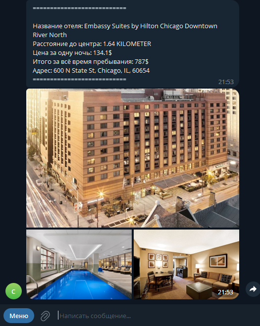
    Команда /bestdeal без фотографий: 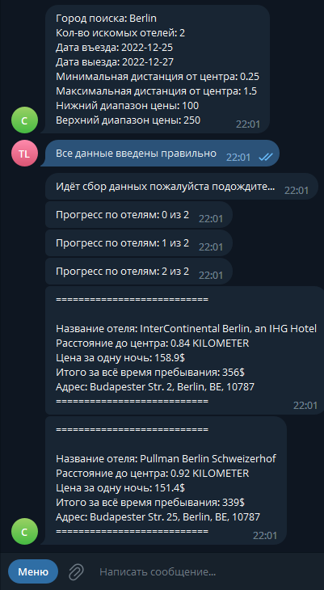
    Команда /bestdeal с фотографиями: 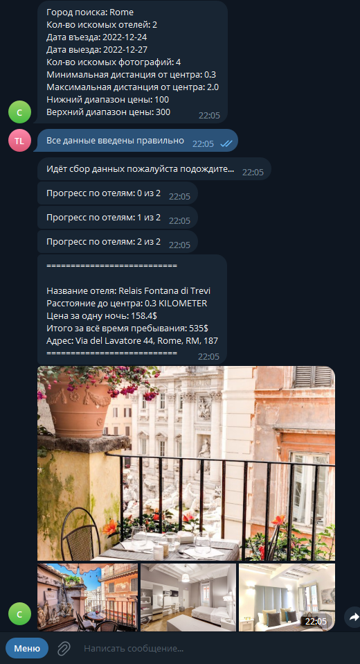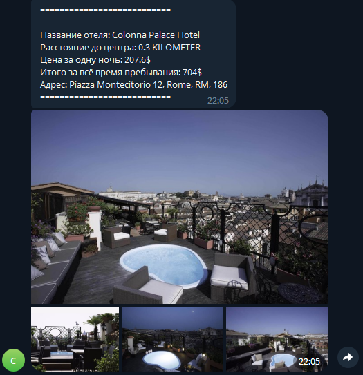
    Команда /history: 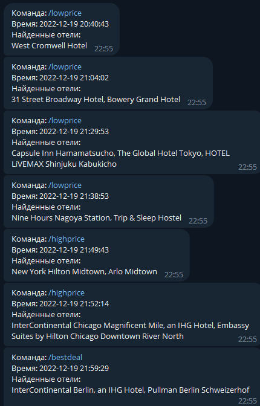 (Исправлено: каждый отель выводится с новой строки)